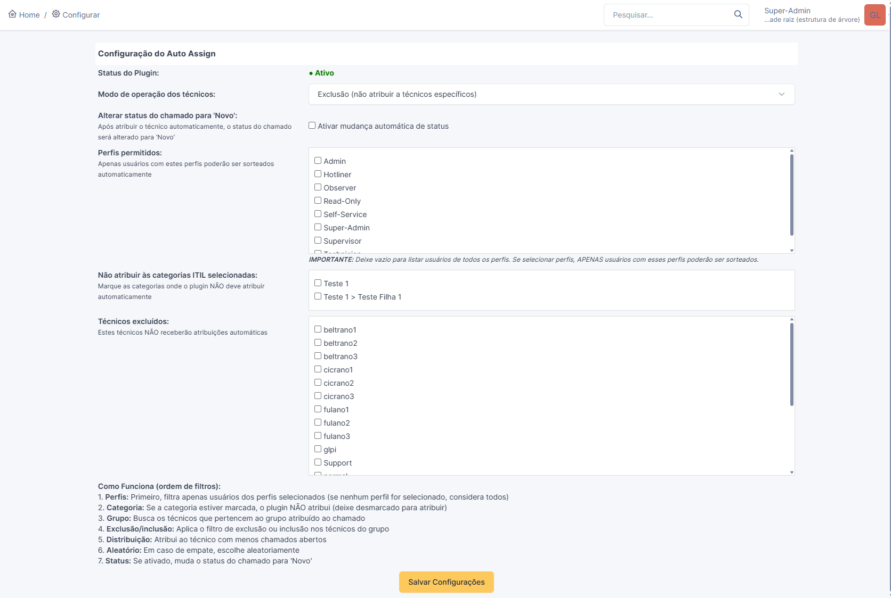
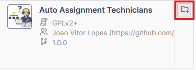

# Autoassign GLPI plugin

- This plugin automatically assigns technicians to a ticket in order to avoid overloading those who already have several tickets on their list, based on the group automatically assigned through rules when tickets are opened.
- It also has other filters, such as: the possibility of removing the automatic assignment of a specific technician (Example: The technician went on vacation) and also being able to choose ITIL categories that will not receive automatic assignment.

## Configuration page

- Each features are configurable from the main config page.

# How to install the plugin:

## On the GLPI server, access the /tmp folder:
- cd /tmp

## Download the plugin:
- 
- wget https://github.com/joaovitorlopes/autoassign/releases/download/1.0.0/autoassign.tar.bz2

## Install bzip2 to extract the contents:
- apt install bzip2 -y

## Unpack the autoassign.tar.bz2 file:
- tar -jxvf autoassign.tar.bz2

## Move the plugin to the GLPI plugins folder:
- mv autoassign /var/www/.../glpi/plugins/

## Now grant permission to the plugin folder:
- chown -R www-data:www-data /var/www/.../glpi/plugins/autoassign/
- chmod -R 755 /var/www/.../glpi/plugins/autoassign/

## Install and activate the plugin from the glpi plugins menu:

